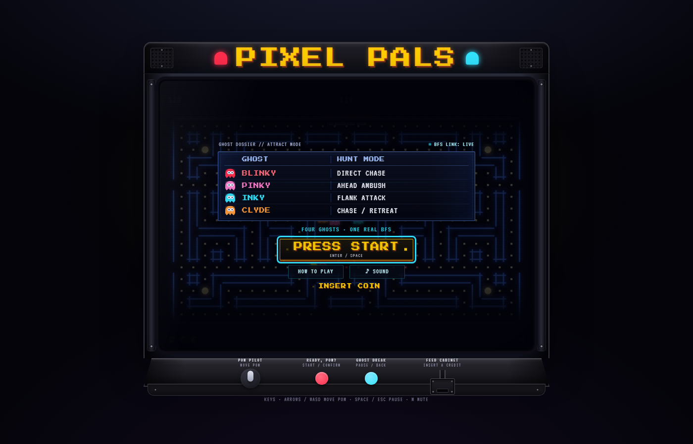
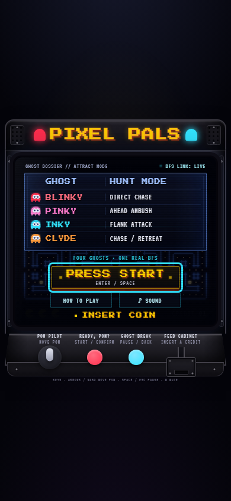

# Pixel Pals

**A retro Pac-Man-style arcade cabinet where four ghosts hunt you with a real breadth-first search.**

Pixel Pals started as a Windows C++ console game: a maze of `#` and `.` where
an `E` chased an `H` using BFS. This version grows that algorithm into four
ghost personalities and puts the whole experience inside a neon coin-op
cabinet.

## Screenshots

The title screen doubles as an attract-mode diagnostic: every ghost's hunting
style is visible before you press start, and the BFS link reports that the
pathfinding system is live.



The layout also scales down cleanly for a phone-sized viewport without losing
the roster, controls, or start button.



## Play

No install, build step, or external assets are required. Serve the folder and
open [http://localhost:8000](http://localhost:8000):

**Live demo:** [pixel-pals-eight.vercel.app](https://pixel-pals-eight.vercel.app)

```bash
python -m http.server 8000
```

You can also double-click [`dist/pixel-pals.html`](dist/pixel-pals.html), a
single self-contained build for offline play.

### Controls

- **Arrow keys** or **WASD** — move Pom
- **Space** or **Esc** — pause / resume
- **M** — mute audio
- Leave the title screen idle to watch the cabinet's attract mode

## Features

- **Four ghosts, four minds.** Blinky chases directly, Pinky ambushes ahead,
  Inky flanks, and Clyde switches between chasing and retreating.
- **Real BFS pathfinding.** Each ghost searches the tunnel-aware maze at every
  decision point; the algorithm is visible in the title-screen roster.
- **Power pellets and ghost chains.** Flashing pellets frighten the ghosts and
  award 200 → 400 → 800 → 1600 points as you clear a chain.
- **A connected maze.** The braided maze has an outer escape loop and
  left-to-right warp tunnels, so there are no dead-end traps.
- **A complete cabinet.** Neon marquee, CRT scanlines, HUD, lives, joystick,
  coin slot, synthesized sound, particles, and subtle attract-mode motion.

## Deploy

This is a static site, so it works on any static host. GitHub Pages is free for
public repositories: enable **Settings → Pages → Deploy from a branch**, choose
the `arcade-redesign` branch (or your default branch) and the `/ (root)` folder.

Vercel Hobby is also free for personal projects. The current production deploy
is [pixel-pals-eight.vercel.app](https://pixel-pals-eight.vercel.app). From the
repository root, publish future updates with:

```bash
npx vercel --prod
```

The CLI will ask you to sign in the first time, then publish `index.html` with
no build command.

## Project layout

```
index.html           arcade cabinet shell + screens
css/style.css        cabinet, CRT, neon HUD, responsive layout
js/                  game systems (see CLAUDE.md for the file map)
legacy/              the original C++ console game
dist/pixel-pals.html single self-contained build
docs/screenshots/    README screenshots captured from the current UI
DESIGN.md            retro-arcade art brief
PLAN.md              build history
CLAUDE.md            architecture and conventions
```

## Credits

Reimagined from a college C++ project; visual direction developed with Google
Stitch. All graphics and audio are procedural — no external assets.
